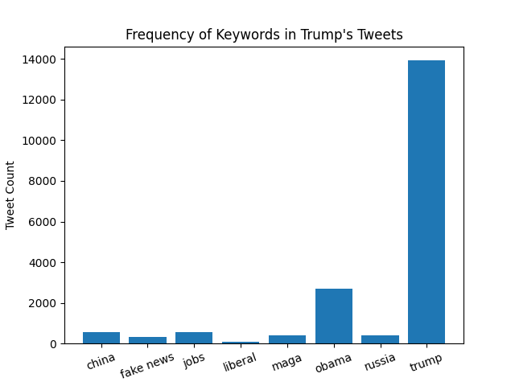

**Description:** 

This table and graph show the frequency of certain words of interest in Trump's tweets from 2009-2018.

The total number of tweets is 36307

|       Phrase       |  Percent of Tweets   |
-------------------- | -------------------- |
|       china        |        01.51         |
|     fake news      |        00.92         |
|        jobs        |        01.58         |
|      liberal       |        00.21         |
|        maga        |        01.09         |
|       obama        |        07.47         |
|       russia       |        01.13         |
|       trump        |        38.35         |

